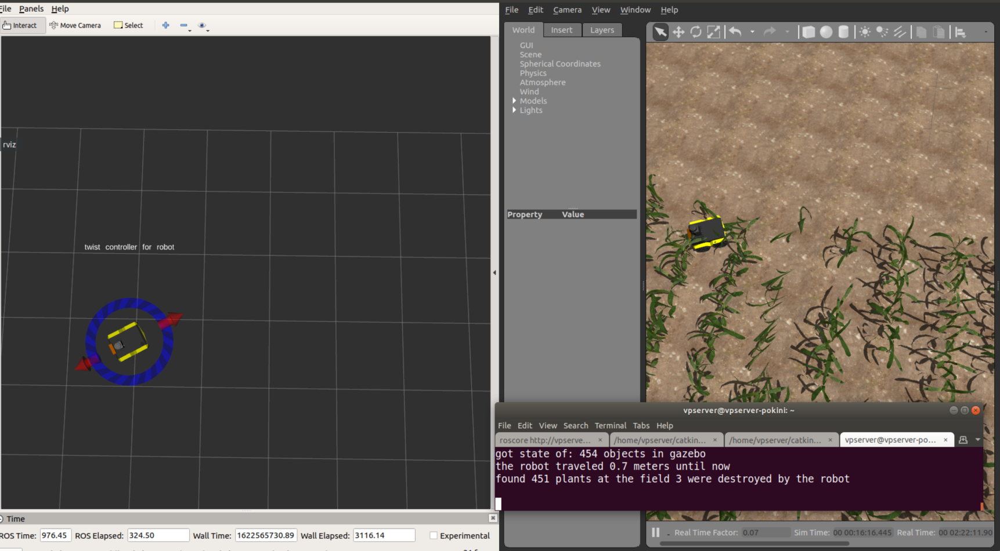

# Evaluation nodes
This repository contains nodes to help with accessing the performance of a robot in Gazebo.

## Destroyed plant counter
This node reads in the Gazebo model states and count destroyed plants and robot distance traveled.

Start node with:
```commandline
rosrun evaluation_nodes fre_counter_node
```



## Detection spawner
This node spawns a visual cylinder in Gazebo if a litter of weed is detected by the robot. It expects a topic with the name `fre_detections` of type `std_msgs/String`.

Start node with:
```commandline
rosrun evaluation_nodes detection_spawner.py
```